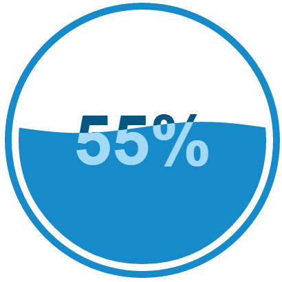

Configurable features include:

* Changeable min/max values.
* All colors.
* Linear gradient.
* Outer circle thickness.
* Gap between the outer circle and inner fill area.
* Wave height.
* Wave speed.
* Wave count.
* Wave rise time.
* Wave height scaling on/off. Reduces the wave height near the min/max values so that the wave won't make the fill area appear total full or totally empty.
* Wave starting offset. Most useful when wave animation is turned off and you want the wave min or max at a specific horizontal position in the fill area.
* Wave rising upon load on/off.
* Wave animation on/off.
* Text height.
* Text verticle position.
* Text increment from min value upon loading.
* Display of % symbol on/off.

Open source under [BSD 2-clause](http://choosealicense.com/licenses/bsd-2-clause/)  
Copyright (c) 2015, Curtis Bratton  
All rights reserved.
